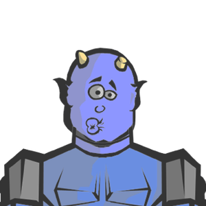

<!-- PROJECT LOGO -->
<br />
<div align="center"> 
  <div>
    <a href="https://github.com/ignasiusadhitia/monsters_rolodex">    
      
    </a>
  </div>
  
  <div>
    <a href="https://github.com/ignasiusadhitia/monsters_rolodex">    
      
    </a>
  </div>
  
  <h3 align="center">Monsters Rolodex</h3>

  <p align="center">
    A mini project about <a href="https://reactjs.org/">React.js</a> basics from <a href="https://www.udemy.com/course/complete-react-developer-zero-to-mastery">Complete React Developer in 2022 (w/ Redux, Hooks, GraphQL)</a>.
    <br />
    <a href="https://github.com/ignasiusadhitia/monsters_rolodex"><strong>Explore the docs »</strong></a>
    <br />
    <br />
    <a href="https://ignasiusadhitia.github.io/monsters_rolodex">View Live Demo</a>
    ·
    <a href="https://github.com/ignasiusadhitia/monsters_rolodex/issues">Report Bug</a>
    ·
    <a href="https://github.com/ignasiusadhitia/monsters_rolodex/issues">Request Feature</a>
  </p>
</div>


<!-- TABLE OF CONTENTS -->
<details>
  <summary>Table of Contents</summary>
  <ol>
    <li>
      <a href="#about-the-project">About The Project</a>
      <ul>
        <li><a href="#built-with">Built With</a></li>
      </ul>
    </li>
    <li>
      <a href="#getting-started">Getting Started</a>
      <ul>
        <li><a href="#prerequisites">Prerequisites</a></li>
        <li><a href="#installation">Installation</a></li>
      </ul>
    </li>
    <li><a href="#demo-video">Demo Video</a></li>
    <li><a href="#project-files-structure">Project Files Structure</a></li>  
    <li><a href="#project-links">Project Links</a></li>
    <li><a href="#contact">Contact</a></li>    
    <li><a href="#acknowledgments">Acknowledgments</a></li> 
  </ol>
</details>


<!-- ABOUT THE PROJECT -->
## About The Project

[![Monsters Rolodex ][product-screenshot]](https://example.com)

The project is from <a href="https://www.udemy.com/course/complete-react-developer-zero-to-mastery">Complete React Developer in 2022 (w/ Redux, Hooks, GraphQL)</a>, Section 3: React Basics.

Monsters Rolodex is a monsters cards website with search functionality. There are 10 monsters with their name, image, and email address. It consummes users API from [JSONPlaceholder - Free Fake Rest API](https://jsonplaceholder.typicode.com/) and monsters image from [RoboHash](https://robohash.org/).

<p align="right">(<a href="#top">back to top</a>)</p>


### Built With

This Monsters Rolodex project was built with [React.js](https://reactjs.org/).

<p align="right">(<a href="#top">back to top</a>)</p>


<!-- GETTING STARTED -->
## Getting Started

### Prerequisites

Please make sure you have the latest version of [Node Package Manager (NPM)](https://www.npmjs.com/) on your system.
* npm
  ```sh
  npm install npm@latest -g
  ```

### Installation

_This is how to run the project on your local environment._

1. Clone the repo
   ```sh
   git clone https://github.com/ignasiusadhitia/monsters_rolodex.git
   ```
2. Open the repo directory
   ```sh
   cd monsters_rolodex
   ```
3. Install NPM packages
   ```sh
   npm install
   ```
4. Run the project
   ```js
   npm start
   ```
5. Your browser will open automatically or you can open it manually and enter this address:
   ```js
   http://localhost:3000/
   ```
   
<p align="right">(<a href="#top">back to top</a>)</p>


<!-- DEMO VIDEO -->
## Demo Video

<video src="https://user-images.githubusercontent.com/81973176/149464395-15fee452-efd5-4482-929b-0ffe70080550.mp4" data-canonical-src="https://user-images.githubusercontent.com/81973176/149464395-15fee452-efd5-4482-929b-0ffe70080550.mp4" controls="controls" muted="muted">
</video>

<p align="right">(<a href="#top">back to top</a>)</p>


<!-- PROJECT FILES STRUCTURE -->
## Project Files Structure

```js
src/
┣ components/
┃ ┣ card/
┃ ┃ ┣ card.component.jsx
┃ ┃ ┗ card.styles.css
┃ ┣ card-list/
┃ ┃ ┣ card-list.component.jsx
┃ ┃ ┗ card-list.styles.css
┃ ┗ search-box/
┃   ┣ search-box.component.jsx
┃   ┗ search-box.styles.css
┣ App.css
┣ App.js
┣ App.test.js
┣ index.css
┣ index.js
┣ logo.svg
┣ reportWebVitals.js
┗ setupTests.js

```

<p align="right">(<a href="#top">back to top</a>)</p>


<!-- PROJECT LINKS -->
## Project Links

Project Link: [https://github.com/ignasiusadhitia/monsters_rolodex](https://github.com/ignasiusadhitia/monsters_rolodex)

Project Live Demo: [https://ignasiusadhitia.github.io/monsters_rolodex](https://ignasiusadhitia.github.io/monsters_rolodex)

<p align="right">(<a href="#top">back to top</a>)</p>


<!-- CONTACT -->
## Contact

Ignasius Yuda Adhitia - [Github](https://github.com/ignasiusadhitia/) - [Gitlab](https://gitlab.com/ignasiusadhitia/) - [LinkedIn](https://www.linkedin.com/in/ignasiusadhitia/) - [Email](hi@ignasiusadhitia.com) - [Website](www.ignasiusadhitia.com)

<p align="right">(<a href="#top">back to top</a>)</p>


<!-- ACKNOWLEDGMENTS -->
## Acknowledgments

* [Complete React Developer in 2022 (w/ Redux, Hooks, GraphQL)](https://www.udemy.com/course/complete-react-developer-zero-to-mastery)
* [JSONPlaceholder - Free Fake Rest API](https://jsonplaceholder.typicode.com/)
* [RoboHash](https://robohash.org/)

<p align="right">(<a href="#top">back to top</a>)</p>


<!-- MARKDOWN LINKS & IMAGES -->
[product-screenshot]: media/screenshot.png

